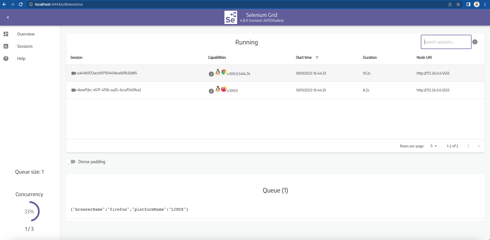
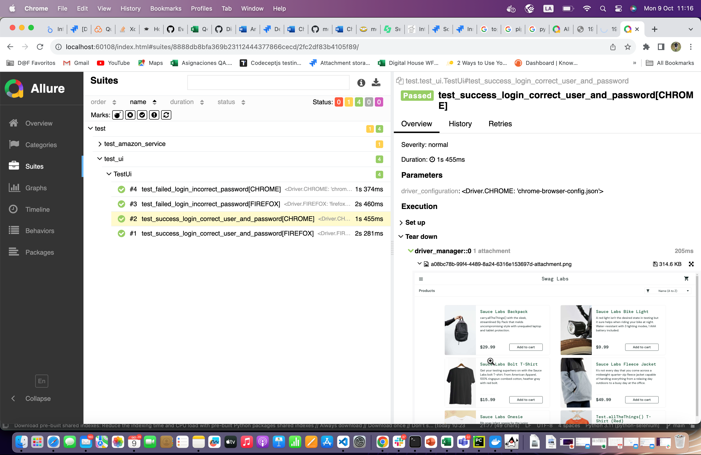

# Python-based automation framework

Automation framework developed by using python and Selenium Web Driver.

## Features

- Remote driver initializer
- Pytest as test framework
- Latest version of Selenium Web Driver
- Page Factory and Page Object Model implemented
  - Assertpy used in Amazon service tests
- Setup and TearDown methods by using pytest fixtures
- Selenium grid(docker-containers-based) to perform cross-browsing testing. UI-related test cases are executed on the following browsers:
  - Chrome
  - Edge
  - Firefox
- Allure as reporting tool

### How to run application:

1. Install [Docker](https://docs.docker.com/engine/install/) and [Allure](https://docs.qameta.io/allure/#_get_started)
2. Clone this repository
3. Open terminal and navigate to cloned repository
4. Run docker-compose file:
 > $ docker-compose -f docker-compose-arm.yml up 
 
  Open a browser and navigate to http://loclahost:4444 to see the remote sessions:

5. Generate allure report:
 > $ allure serve allure/allure-results

